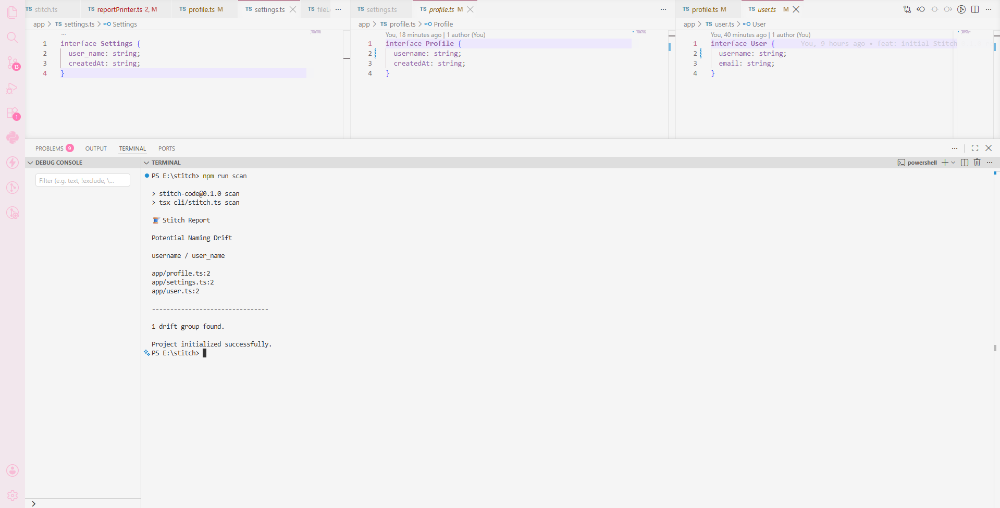
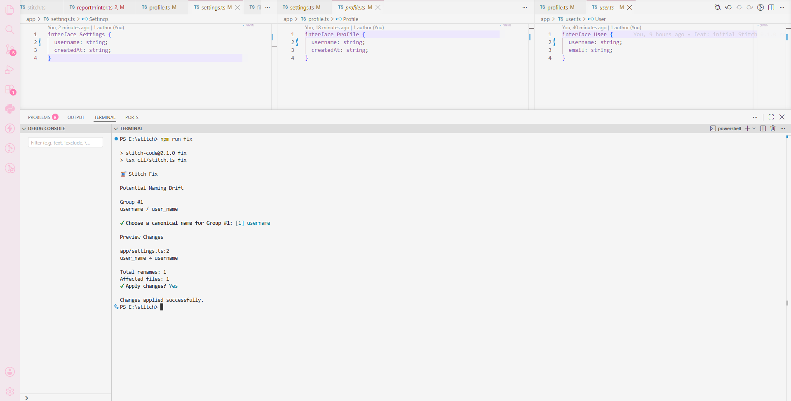
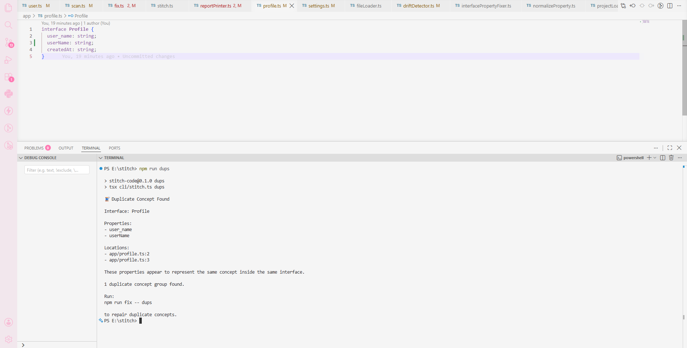
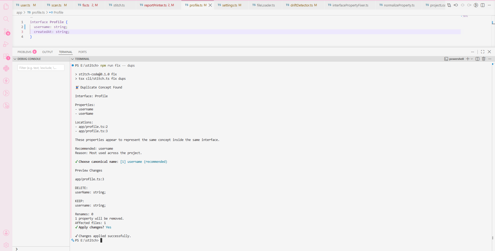

# 🧵 Stitch

<p align="center">
  <strong>Detect naming drift. Repair it safely.</strong>
</p>

<p align="center">
  A TypeScript CLI for detecting inconsistent interface-property names, resolving duplicate concepts, and applying AST-safe repairs.
</p>

<p align="center">
  <a href="#features">Features</a> ·
  <a href="#installation">Installation</a> ·
  <a href="#usage">Usage</a> ·
  <a href="#safety">Safety</a> ·
  <a href="#roadmap">Roadmap</a>
</p>

<p align="center">
  
  
  
  
  
</p>

---

> ⚠️ **Current scope**  
> Stitch currently analyzes and modifies **TypeScript interface property declarations only**. It does not rename runtime usages, variables, functions, comments, strings, or JSON files.

## ✨ Features

| Feature | Description |
| --- | --- |
| 🔎 Naming-drift detection | Finds interface-property variations such as `userName`, `user_name`, and `username` across a project. |
| 📋 Compact reports | Shows detected variants with affected file paths and line numbers. |
| 🔬 Verbose reports | Adds interface names and individual property details. |
| ✏️ Interactive drift repair | Lets developers select a canonical property name, review changes, and confirm before files are edited. |
| 🧩 Duplicate concept detection | Finds properties with equivalent normalized names inside the same interface. |
| 🔍 Read-only duplicate diagnostics | `dups` reports duplicate groups without prompting or modifying files. |
| 🧠 Project-wide canonical suggestions | Duplicate repair counts all project-wide variants and recommends the dominant spelling. |
| 🛠️ Canonical-name duplicate repair | Lets developers select any project-wide variant as the canonical property name. |
| 🗑️ Safe duplicate cleanup | Renames one surviving declaration and removes the other duplicate declarations through the AST. |
| ⚠️ Type mismatch protection | Refuses automatic duplicate cleanup when equivalent properties use different types. |
| 🛡️ Preview-first edits | Shows proposed renames, deletions, totals, and warnings before requiring confirmation. |

## 📸 Preview

### Naming-drift detection



### Naming-drift repair



### Duplicate concept diagnosis



### Duplicate concept repair



> Stitch is intentionally interactive.
> Try the commands yourself to explore canonical-name selection,
> preview workflows, warnings, and repair strategies.

## 📦 Installation

```bash
git clone https://github.com/NairaMehjabin/stitch.git
cd stitch
npm install
```

### Requirements

- Node.js 18+
- A TypeScript project containing `.ts` or `.tsx` files

## ⚡ Quick Start

```bash
npm install
npm run scan
npm run fix
npm run dups
npm run fix -- dups
```

Create `stitch.config.json` in the project root:

```json
{
  "scan": ["."],
  "exclude": ["**/node_modules/**", "**/dist/**"]
}
```

`"."` scans all TypeScript and TSX files below the current directory.

For a monorepo or selected project folders:

```json
{
  "scan": ["apps", "packages", "shared"],
  "exclude": ["**/node_modules/**", "**/dist/**"]
}
```

## 🚀 Usage

| Command | Purpose | Modifies files? |
| --- | --- | --- |
| `npm run scan` | Detect property naming drift. | No |
| `npm run stitch -- scan --verbose` | Show detailed naming-drift occurrences. | No |
| `npm run fix` | Repair naming drift interactively. | Only after confirmation |
| `npm run dups` | Diagnose duplicate concepts inside interfaces. | No |
| `npm run fix -- dups` | Repair duplicate concepts interactively. | Only after confirmation |

Direct CLI commands:

```bash
stitch scan
stitch scan --verbose
stitch fix
stitch dups
stitch fix dups
```

## 🔎 Naming Drift

Stitch finds normalized-equivalent property names used across different interfaces or files.

```ts
// app/profile.ts
interface Profile {
  userName: string;
}
```

```ts
// app/settings.ts
interface Settings {
  user_name: string;
}
```

```bash
npm run scan
```

```text
🧵 Stitch Report

Potential Naming Drift

userName / user_name

app/profile.ts:2
app/settings.ts:2

--------------------------------

1 drift group found.
```

### Detailed report

```bash
npm run stitch -- scan --verbose
```

```text
🧵 Stitch Detailed Report

Group #1

Variants:
- userName
- user_name

Occurrences:

app/profile.ts:2

Interface:
Profile

Property:
userName
```

## ✏️ Repair Naming Drift

```bash
npm run fix
```

```text
🧵 Stitch Fix

Potential Naming Drift

Group #1
userName / user_name / username

? Choose a canonical name for Group #1:
  [1] userName
  [2] user_name
  [3] username

Preview Changes

app/settings.ts:2
user_name → userName

Total renames: 1
Affected files: 1

? Apply changes? (y/N)
```

Stitch applies changes only after explicit confirmation.

## 🧩 Duplicate Concepts

Duplicate concepts are properties inside the **same interface** that normalize to the same concept.

```ts
interface Settings {
  user_name: string;
  userName: string;
  createdAt: string;
}
```

### Diagnose duplicates

```bash
npm run dups
```

```text
🧵 Duplicate Concept Found

Interface: Settings

Properties:
- user_name
- userName

Locations:
- app/settings.ts:2
- app/settings.ts:3

These properties appear to represent the same concept inside the same interface.

1 duplicate concept group found.

Run:
npm run fix -- dups

to repair duplicate concepts.
```

`dups` is read-only. It never prompts or modifies files.

## 🛠️ Repair Duplicate Concepts

```bash
npm run fix -- dups
```

Stitch scans the configured project for every spelling of the same normalized property concept.

Given:

```ts
// app/profile.ts
interface Profile {
  user_name: string;
}
```

```ts
// app/user.ts
interface User {
  user_name: string;
}
```

```ts
// app/settings.ts
interface Settings {
  username: string;
  userName: string;
}
```

Stitch can recommend the project-wide convention:

```text
🧵 Duplicate Concept Found

Interface: Settings

Properties:
- username
- userName

Locations:
- app/settings.ts:2
- app/settings.ts:3

These properties appear to represent the same concept inside the same interface.

Recommended: user_name
Reason: Most used across the project.

? Choose canonical name:
  [1] user_name (recommended)
  [2] username
  [3] userName
```

The selected canonical name may come from anywhere in the scanned project. Stitch then:

1. Keeps the first duplicate property declaration.
2. Renames that declaration to the selected canonical name using ts-morph.
3. Removes the other duplicate declarations using ts-morph.
4. Preserves the property type.
5. Refuses the repair if the canonical name already exists separately in that interface.

Example preview:

```text
Preview Changes

app/settings.ts:2

RENAME:
username → user_name

app/settings.ts:3

DELETE:
userName: string;

KEEP:
user_name: string;

Renames: 1
1 property will be removed.
Affected files: 1

? Apply changes? (y/N)
```

If a non-recommended canonical name is selected:

```text
⚠ Naming Drift Warning

Keeping "userName" may create naming inconsistencies.

Run:
npm run scan

to diagnose naming drift.
```

The warning is advisory. Developers always retain final control.

## ⚠️ Type Safety

Stitch does not automatically repair duplicate concepts when types differ.

```ts
interface Settings {
  user_name: string;
  userName: number;
}
```

```text
⚠ Manual Review Required

Properties normalize to the same concept but have different types.

user_name: string
userName: number

No automatic fix available.
```

## 🏗️ Architecture

```text
stitch/
├── cli/
│   ├── stitch.ts       # Command registration
│   ├── scan.ts         # Naming-drift reporting
│   ├── fix.ts          # Naming-drift repair
│   ├── dups.ts         # Read-only duplicate diagnosis
│   └── fixDups.ts      # Interactive duplicate repair
├── scanner/
│   ├── fileLoader.ts
│   ├── projectLoader.ts
│   ├── driftDetector.ts
│   └── duplicateConceptDetector.ts
├── fixer/
│   ├── interfacePropertyFixer.ts
│   └── duplicatePropertyFixer.ts
└── utils/
    ├── normalizePath.ts
    └── normalizeProperty.ts
```

```text
stitch.config.json
        ↓
Discover TypeScript / TSX files
        ↓
Parse files with ts-morph
        ↓
Collect interface properties
        ↓
scan → report cross-project naming drift
fix  → repair naming-drift declarations
dups → report same-interface duplicates
fix dups → choose canonical name, preview, confirm, repair
```

## 🛡️ Safety

Stitch is intentionally conservative.

- Uses `ts-morph` AST operations for all code changes.
- Does not use regex replacement.
- Does not use raw string replacement.
- Edits only TypeScript interface property declarations.
- Never renames runtime property usages.
- Never modifies variables, functions, strings, comments, or JSON files.
- Requires a preview before modifying files.
- Requires explicit confirmation before saving files.
- Blocks duplicate cleanup when property types differ.
- Blocks canonical-name repair if it would create a separate duplicate property in the same interface.

## 💡 Why Stitch?

Naming drift happens naturally during refactors, team collaboration, and AI-assisted development:

```ts
userName
user_name
username
```

Those differences make code harder to search, maintain, and standardize.

Stitch separates two related but distinct problems:

- **Naming drift:** the same concept uses different names across files and interfaces.
- **Duplicate concepts:** equivalent properties coexist inside the same interface.

It makes both visible, then offers narrowly scoped, reviewable, AST-safe repairs.

## 🛠️ Tech Stack

- [TypeScript](https://www.typescriptlang.org/)
- [Node.js](https://nodejs.org/)
- [Commander.js](https://github.com/tj/commander.js)
- [ts-morph](https://ts-morph.com/)
- [Inquirer](https://github.com/SBoudrias/Inquirer.js) 
 
## 🗺️ Roadmap 
 
### Implemented 
 
- [x] Interface-property naming-drift detection 
- [x] Compact naming-drift reports 
- [x] Verbose naming-drift reports 
- [x] Interactive naming-drift repair 
- [x] Preview and confirmation workflow 
- [x] Duplicate concept diagnosis 
- [x] Read-only `dups` command 
- [x] Project-wide canonical-variant counting 
- [x] Canonical-name selection for duplicate repair 
- [x] AST-based renaming and duplicate deletion 
- [x] Type mismatch protection 
- [x] Naming-drift warnings for non-recommended choices 
 
### Planned 
 
- [ ] Configurable naming-convention preferences 
- [ ] Variable naming-drift detection 
- [ ] Function naming-drift detection 
- [ ] Type alias consistency checks 
- [ ] Enum consistency checks 
- [ ] Project-wide property usage refactors 
- [ ] Safer cross-file reference updates 
- [ ] VS Code extension 
- [ ] CI/CD integration 
- [ ] GitHub Actions integration 
- [ ] Team-wide consistency enforcement 
 
> Roadmap items are plans only; they are not currently implemented. 
 
## 🤝 Contributing 
 
Contributions, bug reports, and ideas are welcome. 
 
1. Fork the repository. 
2. Create a focused branch. 
3. Make your change. 
4. Test the relevant CLI commands. 
5. Open a pull request with a clear description. 
 
Please preserve Stitch’s core principle: 
 
> **Safety before convenience.** 
 
## 📄 License 
 
This project is licensed under the ISC License. See [LICENSE](./LICENSE) for details. 
 
## 👤 Author 
 
**Naira Mehjabin** 
 
- Portfolio: [st4rligh7.vercel.app](https://st4rligh7.vercel.app)
- GitHub: [@NairaMehjabin](https://github.com/NairaMehjabin) 
- Fiverr: [@naira_mehjabin](https://www.fiverr.com/s/99m680a)
- Email: nairamehjabin2014@gmail.com 
 
--- 
 
<p align="center"> 
  Built for cleaner, more consistent TypeScript codebases. 🧵 
</p>
